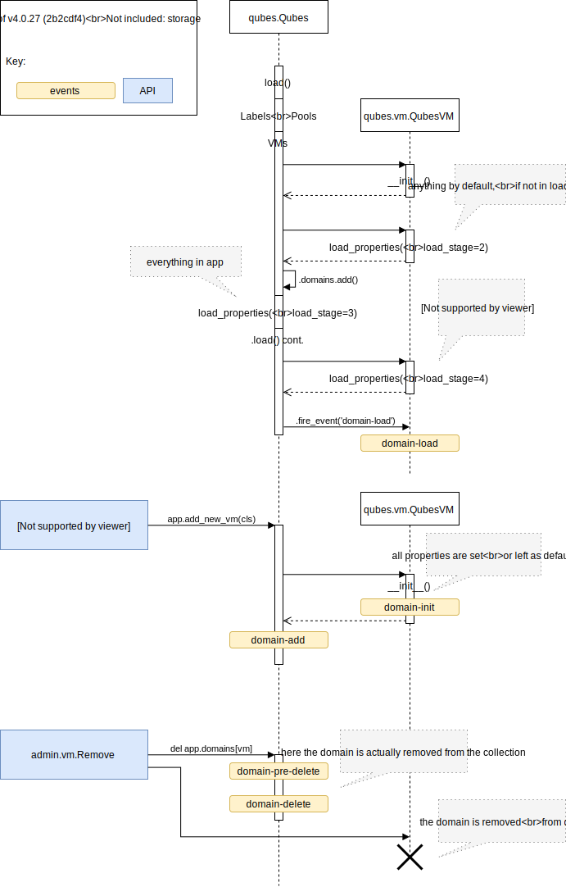

:py:mod:`qubes` -- Common concepts
==================================

Global Qubes object
-------------------

Because all objects in Qubes' world are interconnected, there is no possibility
to instantiate them separately. They are all loaded together and contained in
the one ``app`` object, an instance of :py:class:`qubes.Qubes` class.

Loading
^^^^^^^

The objects may come to existence in two ways: by explicit instantiation or by
loading from XML file.

The loading from XML is done in stages, because Qubes domains are dependent on
each other in what can be even a circular dependency. Therefore some properties
(especcialy those that refer to another domains) are loaded later.

Refer to :py:class:`qubes.Qubes` class documentation to get description of every
stage.

Properties
----------

Many parameters of Qubes can be changed -- from names of particular domains to
default NetVM for all AppVMs. All of those *configurable* parameters are called
*properties* and can be accessed like Python attributes on their owners::

   >>> import qubes
   >>> app = qubes.Qubes()
   >>> app.domain[0] # docutils: +ELLIPSIS
   <AdminVM ...>
   >>> app.domain[0].name
   'dom0'

Definition
^^^^^^^^^^
Properties are defined on global :py:class:`qubes.Qubes` application object and
on every domain. Those classess inherit from :py:class:`PropertyHolder` class,
which is responsible for operation of properties.

Each Qubes property is actually a *data descriptor* (a Python term), which means
they are attributes of their classess, but when trying to access it from
*instance*, they return it's underlying value instead. They can be thought of as
Python's builtin :py:class:`property`, but greatly enhanced. They are defined in
definition of their class::

   >>> import qubes
   >>> class MyTestHolder(qubes.PropertyHolder):
   >>>     testprop = qubes.property('testprop')
   >>> instance = MyTestHolder()
   >>> instance.testprop = 'aqq'
   >>> instance.testprop
   'aqq'

If you like to access some attributes of the property *itself*, you should refer
to instance's class::

   >>> import qubes
   >>> class MyTestHolder(qubes.PropertyHolder):
   >>>     testprop = qubes.property('testprop')
   >>> instance = MyTestHolder()
   >>> instance.testprop = 'aqq'

   >>> type(instance.testprop)
   <type 'str'>
   >>> type(instance.__class__.testprop)
   <class 'qubes.property'>

   >>> instance.__class__.testprop.__name__
   'testprop'

As a rule, properties are intended to be serialised and deserialised to/from XML
file. There are very few exceptions, but if you don't intend to save the
property to XML, you should generally go for builtin :py:class:`property`.

One important difference from builtin properties is that there is no getter
function, only setter. In other words, they are not dynamic, you cannot return
different value every time something wants to access it. This is to ensure that
while saving the property is not a moving target.

Property's properties
^^^^^^^^^^^^^^^^^^^^^
You can specify some parameters while defining the property. The most important
is the `type`: on setting, the value is coerced to this type. It is well suited
to builtin types like :py:class:`int`::

   >>> import qubes
   >>> class MyTestHolder(qubes.PropertyHolder):
   >>>     testprop = qubes.property('testprop')
   >>>     intprop = qubes.property('intprop', type=int)

   >>> instance = MyTestHolder()
   >>> instance.testprop = '123'
   >>> instance.intprop = '123'

   >>> instance.testprop
   '123'
   >>> instance.intprop
   123

Every property should be documented. You should add a short description to your
property, which will appear, among others, in :program:`qvm-prefs` and
:program:`qvm-ls` programs. It should not use any Sphinx-specific markup::

   >>> import qubes
   >>> class MyTestHolder(qubes.PropertyHolder):
   >>>     testprop = qubes.property('testprop',
   >>>         doc='My new and shiny property.')
   >>> MyTestHolder.testprop.__doc__
   'My new and shiny property.'

In addition to `type`, properties also support `setter` parameter. It acts
similar to `type`, but is always executed (not only when types don't agree) and
accepts more parameters: `self`, `prop` and `value` being respectively: owners'
instance, property's instance and the value being set. There is also `saver`,
which does reverse: given value of the property it should return a string that
can be parsed by `saver`.

Unset properties and default values
^^^^^^^^^^^^^^^^^^^^^^^^^^^^^^^^^^^
Properties may be unset, even if they are defined (that is, on access they raise
:py:exc:`AttributeError` -- that is the normal Python way to tell that the
attribute is absent). You can manually unset a property using Python's ``del``
statement::

   >>> import qubes
   >>> class MyTestHolder(qubes.PropertyHolder):
   >>>     testprop = qubes.property('testprop')
   >>> instance = MyTestHolder()
   >>> instance.testprop
   AttributeError: ...
   >>> instance.testprop = 123
   >>> instance.testprop
   123
   >>> del instance.testprop
   >>> instance.testprop
   AttributeError: ...

Alternatively, some properties may return some other value instead, if that's
the reasonable thing to do. For example, when
:py:attr:`qubes.vm.qubesvm.QubesVM.netvm` is unset, we check global setting
:py:attr:`qubes.Qubes.default_netvm` instead. Returning :py:obj:`None` as
default would be wrong, as it is marker that means „no NetVM, machine
disconnected”.

You can define a default value either as constant or as a callable. In the
second case, the callable should accept one argument, the instance that owns the
property::

   >>> import qubes
   >>> class MyTestHolder(qubes.PropertyHolder):
   >>>     testprop = qubes.property('testprop')
   >>>     def1prop = qubes.property('testprop', default=123)
   >>>     netvm = qubes.property('testprop',
   >>>         default=(lambda self: self.app.default_netvm))

   >>> instance = MyTestHolder()
   >>> instance.testprop
   AttributeError: ...
   >>> instance.def1prop
   123
   >>> instance.netvm # doctest: +SKIP
   <NetVM ...>

Setting netvm on particular domain of course does not affect global default, but
only this instance. But there are two problems:

- You don't know if the value of the property you just accessed was it's
  true or default value.
- After ``del``'ing a property, you still will get a value on access. You
  cannot count on `AttributeError` raised from them.

Therefore Qubes support alternative semantics. You can (and probably should,
wherever applicable) use no ``del``, but assignment of special magic object
:py:obj:`qubes.property.DEFAULT`. There is also method
:py:meth:`qubes.PropertyHolder.property_is_default`, which can be used to
distinguish unset from set properties::

   >>> import qubes
   >>> class MyTestHolder(qubes.PropertyHolder):
   >>>     testprop = qubes.property('testprop', default=123)
   >>> instance.testprop
   123
   >>> instance.property_is_default('testprop')
   True
   >>> instance.testprop = 123
   >>> instance.testprop
   >>> instance.property_is_default('testprop')
   False
   >>> instance.testprop = qubes.property.DEFAULT
   >>> instance.property_is_default('testprop')
   True

Inheritance
^^^^^^^^^^^
Properties in subclassess overload properties from their parents, like
expected::

   >>> import qubes
   >>> class MyTestHolder(qubes.PropertyHolder):
   >>>     testprop = qubes.property('testprop')

   >>> class MyOtherHolder(MyTestHolder):
   >>>     testprop = qubes.property('testprop', setter=qubes.property.forbidden)

   >>> instance = MyOtherHolder()
   >>> instane.testprop = 123
   TypeError: ...

Module contents
---------------

.. automodule:: qubes
   :members:
   :show-inheritance:

.. vim: ts=3 sw=3 et
